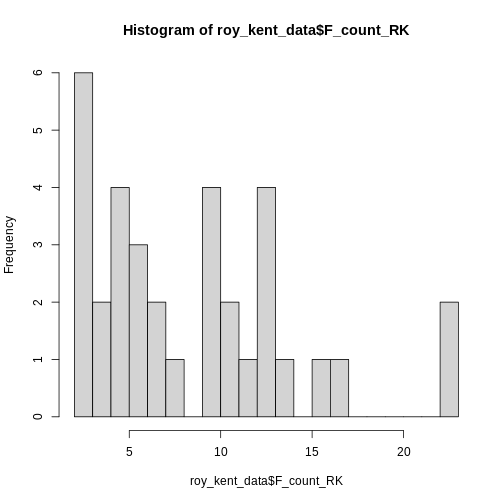
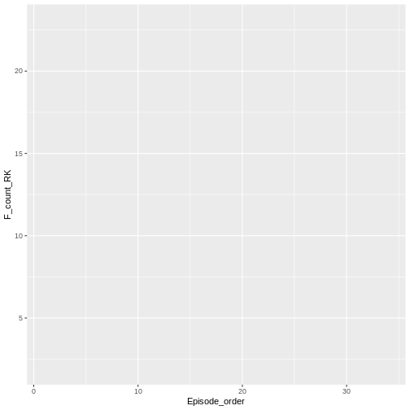
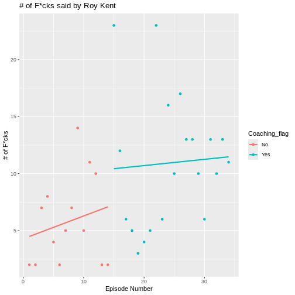
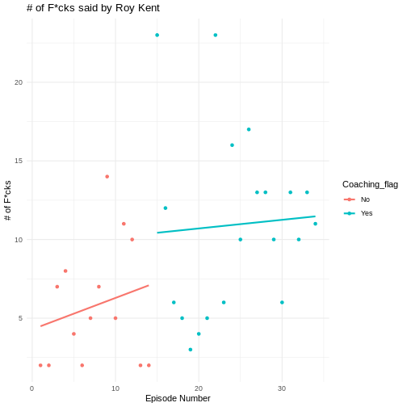

:::::::::::::::::::::::::::::::::::::: questions 

- How can you get an overview of data?
- How do you visualize distributions of data?

::::::::::::::::::::::::::::::::::::::::::::::::

::::::::::::::::::::::::::::::::::::: objectives

- Learn how to read in `.csv` files
- Learn how to explore a dataset for the first time
- Learn how to visualize key statistics of data

::::::::::::::::::::::::::::::::::::::::::::::::

## Reading in data

You already had to read in data in the last lesson. Data comes in many shapes and sizes. The format of data you had to read in the last session is called `csv`, for *comma-separated values*. This is one of the most common data formats. It gets its name because all values are separated from each other using a comma ",". Here in Germany, `csv` files are sometimes separated by a semicolon ";" instead. This can be adjusted in R-code by using `read.csv("path/to/file", sep = ";")` and declaring the semicolon as the separating variable.

::: callout
## Reading data requires specific functions
There are several other common formats including `.xlsx` for excel files, `.sav` for SPSS files, `.txt` for simple text files and `.rdata` for a special R-specific data format. These files can not be read in by `read.csv()`, as this is only for `.csv` files. Instead, use specific functions for each format like `readxl::read_excel()`, or `haven::read_sav()`.
:::

Let's again read in the data about Roy Kent's potty-mouth.


``` r
roy_kent_data <- read.csv("data/roy_kent_f_count.csv")
```

## Getting a glimpse of the data

When starting out with some data you received, it is important to familiarize yourself with the basics of this data first. What columns does it have, what information is contained in each row? What do the columns mean?

One option to get a quick overview of the data is... just looking at it! By clicking on the data in the *Environment* tab or typing `View(roy_kent_data)` in the console, you can inspect the data in R Studio. This will already show you how many observations (in this case rows) and variables (columns) the data has. We can also inspect the column names and see the first few entries. Look at the data, what might each column represent?

Now, let's go back to using programming to inspect data. We already learned about the handy function `glimpse()`, for which we need the `dplyr` package.


``` r
library(dplyr)

glimpse(roy_kent_data)
```

``` output
Rows: 34
Columns: 16
$ Character         <chr> "Roy Kent", "Roy Kent", "Roy Kent", "Roy Kent", "Roy…
$ Episode_order     <int> 1, 2, 3, 4, 5, 6, 7, 8, 9, 10, 11, 12, 13, 14, 15, 1…
$ Season            <int> 1, 1, 1, 1, 1, 1, 1, 1, 1, 1, 2, 2, 2, 2, 2, 2, 2, 2…
$ Episode           <int> 1, 2, 3, 4, 5, 6, 7, 8, 9, 10, 1, 2, 3, 4, 5, 6, 7, …
$ Season_Episode    <chr> "S1_e1", "S1_e2", "S1_e3", "S1_e4", "S1_e5", "S1_e6"…
$ F_count_RK        <int> 2, 2, 7, 8, 4, 2, 5, 7, 14, 5, 11, 10, 2, 2, 23, 12,…
$ F_count_total     <int> 13, 8, 13, 17, 13, 9, 15, 18, 22, 22, 16, 22, 8, 6, …
$ cum_rk_season     <int> 2, 4, 11, 19, 23, 25, 30, 37, 51, 56, 11, 21, 23, 25…
$ cum_total_season  <int> 13, 21, 34, 51, 64, 73, 88, 106, 128, 150, 16, 38, 4…
$ cum_rk_overall    <int> 2, 4, 11, 19, 23, 25, 30, 37, 51, 56, 67, 77, 79, 81…
$ cum_total_overall <int> 13, 21, 34, 51, 64, 73, 88, 106, 128, 150, 166, 188,…
$ F_score           <dbl> 0.1538462, 0.2500000, 0.5384615, 0.4705882, 0.307692…
$ F_perc            <dbl> 15.4, 25.0, 53.8, 47.1, 30.8, 22.2, 33.3, 38.9, 63.6…
$ Dating_flag       <chr> "No", "No", "No", "No", "No", "No", "No", "Yes", "Ye…
$ Coaching_flag     <chr> "No", "No", "No", "No", "No", "No", "No", "No", "No"…
$ Imdb_rating       <dbl> 7.8, 8.1, 8.5, 8.2, 8.9, 8.5, 9.0, 8.7, 8.6, 9.1, 7.…
```

This will tell us the variable type of each column, too. We can see that the first column is a character column which just contains the name of the hero of this data *Roy Kent*. The second column is an integer (so whole numbers) vector with information about the episode number.

write about the background of the show (pics)

Next, let's try to figure out what each of the column names mean and what type of information is stored here. Some columns are self-explanatory like "Season" oder "Episode". Others might require a bit of background knowledge like "Imdb_rating", which requires you to know about the film-rating platform "Imdb". 

Some columns are riddled with abbreviations that make their names easier to write, but harder to understand. `F_count_RK` is using RK as an abbreviation of Roy Kent and F as an abbreviation for... something else. `cum_rk_overall` is a cumulative (running) total of the number of times Roy used the F-word. 

Yet other columns are really difficult to understand, because the implication is not 100% clear. What does `F_count_total` mean? The number of times "Fuck" was said in an episode? Seems like a reasonable guess, but in order to be sure, it's best if we had some documentation of the data's author's intentions. This is often called a *codebook*, where the person compiling data writes down information about the meaning of column names, cleaning procedures and other oddities of the data. When sharing your own data online, this is essential in order to make your data useable for others.

There is no codebook included in this workshop, but you can find it online. The data is taken from an event called "Tidy-Tuesday", a weekly event about cleaning and presenting interesting data using R. You can find information about the Roy Kent data [here](https://github.com/rfordatascience/tidytuesday/blob/main/data/2023/2023-09-26/readme.md). Give it a read in order to make sure you know what all the columns are about.

## Inspecting important values
Now that we understand the structure of the data and the names of the columns, we can start getting a look at the data itself. A good way to get an overview of the columns is `psych::describe()`. This outputs you some basic information of the data.


``` r
psych::describe(roy_kent_data) # describe() function from psych package
```

``` output
                  vars  n   mean     sd median trimmed    mad   min    max
Character*           1 34   1.00   0.00   1.00    1.00   0.00  1.00   1.00
Episode_order        2 34  17.50   9.96  17.50   17.50  12.60  1.00  34.00
Season               3 34   2.06   0.81   2.00    2.07   1.48  1.00   3.00
Episode              4 34   6.21   3.37   6.00    6.18   4.45  1.00  12.00
Season_Episode*      5 34  17.50   9.96  17.50   17.50  12.60  1.00  34.00
F_count_RK           6 34   8.82   5.63   7.50    8.25   5.19  2.00  23.00
F_count_total        7 34  21.82  11.53  18.00   20.86   8.15  6.00  46.00
cum_rk_season        8 34  53.79  37.29  50.00   51.36  40.77  2.00 138.00
cum_total_season     9 34 126.32  93.71 110.50  115.79  88.96 13.00 377.00
cum_rk_overall      10 34 130.74  92.69 124.50  127.25 118.61  2.00 300.00
cum_total_overall   11 34 308.09 215.14 275.50  296.61 246.11 13.00 742.00
F_score             12 34   0.40   0.15   0.36    0.38   0.15  0.15   0.72
F_perc              13 34  39.57  15.02  35.70   38.49  15.20 15.40  71.90
Dating_flag*        14 34   1.44   0.50   1.00    1.43   0.00  1.00   2.00
Coaching_flag*      15 34   1.59   0.50   2.00    1.61   0.00  1.00   2.00
Imdb_rating         16 34   8.33   0.66   8.50    8.39   0.59  6.60   9.40
                   range  skew kurtosis    se
Character*          0.00   NaN      NaN  0.00
Episode_order      33.00  0.00    -1.31  1.71
Season              2.00 -0.10    -1.53  0.14
Episode            11.00  0.06    -1.26  0.58
Season_Episode*    33.00  0.00    -1.31  1.71
F_count_RK         21.00  0.79     0.05  0.97
F_count_total      40.00  0.78    -0.58  1.98
cum_rk_season     136.00  0.48    -0.82  6.39
cum_total_season  364.00  0.93     0.16 16.07
cum_rk_overall    298.00  0.28    -1.27 15.90
cum_total_overall 729.00  0.42    -1.06 36.90
F_score             0.56  0.60    -0.74  0.03
F_perc             56.50  0.60    -0.74  2.58
Dating_flag*        1.00  0.23    -2.01  0.09
Coaching_flag*      1.00 -0.34    -1.94  0.09
Imdb_rating         2.80 -0.81     0.31  0.11
```

In my opinion, the most important information in this table are the mean value of a column and the maximum and minimum value. The mean value reveals some important information about the average value of a given variable, duh... And the minimum and maximum value can reveal issues in the data. Is the minimum age -2? Or the maximum IQ 1076? Something might be wrong in this data, and looking at the minimum and maximum values might already give you a clue.

Let's start visualizing some basic information. I have already proclaimed my love for histograms as a quick and dirty tool to get an overview and the simplicity of its code is a reason why!


``` r
hist(roy_kent_data$F_count_RK) # Recall that the $ operator gets you a variable from a dataframe
```


Only 5 bars seem to be to few to visualize the distribution adequately, so lets try 10 instead.


``` r
hist(roy_kent_data$F_count_RK, breaks = 10)
```


This already provides us some more useful information. Roy seems to sweat between 0 and 12 times most often and swears a lot in one episode (we will find out later, which one that is).

Let's try increasing the number of breaks to 20.


``` r
hist(roy_kent_data$F_count_RK, breaks = 20)
```



Here, an interesting pattern seems to emerge. Three different clusters of swear counts show up, one where Roy swears between 0 - 7 times, presumably because he has little screen-time in the episode. One cluster where Roy swears between 9-17 times, which more closely resembles his average swearing amount. And finally two episodes where Roy flies of the handle and swears a whopping `max(roy_kent_data$F_count_RK) = ` 23 times!

In order to figure out what makes Roy swear so much, let's plot the number of times Roy swears by episode!

## ggplot2

For most of our plotting needs (except the beautiful `hist()`), we will make use of the package `ggplot2` which is part of the larger collection of packages `tidyverse` and provides some really useful plotting functions. Most importantly, ggplot provides a useful *grammar* of plotting functions that always follow the same format.

You start out with the function `ggplot()`, simple enough.

``` r
ggplot(data = roy_kent_data)
```

``` error
Error in ggplot(data = roy_kent_data): could not find function "ggplot"
```
Oops, R tells us that it cannot find this function. Most of the time, this is because you forgot to load the package beforehand. Let's try again:


``` r
library(ggplot2)

ggplot(data = roy_kent_data)
```


Now it works, but not really. For now, this code only tells the function which data we are using, not what to do with it.

In order to actually see a plot, we need to provide information about the visual properties, the *aesthetics* that the plot should have. The `mapping` argument tells the function how the data relates to the visual properties defined using `aes()`. Here, we define the columns that we want on the x-axis and y-axis.


``` r
ggplot(
  data = roy_kent_data,
  mapping = aes(x = Episode_order, y = F_count_RK)
)
```



While we cannot see anything useful yet, we already notice some changes. The plot now correctly shows the names of the variables on the axes. Also, the ranges of numbers printed on the axes matches the minimum and maximum values.

Now that we provided the data and the mapping of variables to the plot, we can start building our proper visualization. This is done *on top* of the basics declared in `ggplot()`. This technique is called *layering* and it allows you to combine multiple new changes to a plot easily using a simple `+`. To add a plot showing the number of Fucks given by Roy during an episode, we can use `geom_point()`.


``` r
ggplot(
  data = roy_kent_data,
  mapping = aes(x = Episode_order, y = F_count_RK)
) +
  geom_point()
```


`geom_point()` adds a simple scatter-plot element to the graph. Now we can also simply change the labels using `labs()`.


``` r
ggplot(
  data = roy_kent_data,
  mapping = aes(x = Episode_order, y = F_count_RK)
) +
  geom_point()+
  labs(
    title = "# of F*cks said by Roy Kent",
    x = "Episode Number",
    y = "# of F*cks"
  )
```


There seems to be a small trend showing that Roy swears more later in the series. We can visualize this trend by adding another layered visual `geom_smooth()`.


``` r
ggplot(
  data = roy_kent_data,
  mapping = aes(x = Episode_order, y = F_count_RK)
) +
  geom_point()+
  labs(
    title = "# of F*cks said by Roy Kent",
    x = "Episode Number",
    y = "# of F*cks"
  )+
  geom_smooth(
    method = "lm", # this forces the trend-line to be linear
    se = FALSE
  )
```

``` output
`geom_smooth()` using formula = 'y ~ x'
```


What might be causing this trend? Well, one possible candidate is that Roy goes from being a player on the team to being a coach on the team. This might cause him to yell at more people than usual. The variable that contains this information is `Coaching_flag`. Let's learn something about it:

``` r
table(roy_kent_data$Coaching_flag)
```

``` output

 No Yes 
 14  20 
```
It seems to have two values "Yes" and "No", each being represented in the data more than 10 times.

We can also add this to our visualization from earlier, coloring in the dots by whether Roy was coaching or not:

``` r
ggplot(
  data = roy_kent_data,
  mapping = aes(x = Episode_order, y = F_count_RK, color = Coaching_flag)
) +
  geom_point()+
  labs(
    title = "# of F*cks said by Roy Kent",
    x = "Episode Number",
    y = "# of F*cks"
  )+
  geom_smooth(
    method = "lm", # this forces the trend-line to be linear
    se = FALSE
  )
```

``` output
`geom_smooth()` using formula = 'y ~ x'
```



Now, a clearer picture emerges. Roy starts of pretty slow as a player, but then begins to swear a lot in the episodes that he is coaching in.

::: callout
## Making plot prettier using themes
The basic plots already look okay and are enough for just finding something out about data. But you can make them even prettier quickly using a theme. Themes in ggplot are collections of visual settings that control the background of the plot, the text size of the axis and some other things. 

I often use `theme_classic()` or `theme_minimal()`, but you can try out different themes or even write your own!


``` r
ggplot(
  data = roy_kent_data,
  mapping = aes(x = Episode_order, y = F_count_RK, color = Coaching_flag)
) +
  geom_point()+
  labs(
    title = "# of F*cks said by Roy Kent",
    x = "Episode Number",
    y = "# of F*cks"
  )+
  geom_smooth(
    method = "lm", # this forces the trend-line to be linear
    se = FALSE
  )+
  theme_minimal()
```

``` output
`geom_smooth()` using formula = 'y ~ x'
```


:::


::: challenge
## Challenge 1

Figure out what total means, give descriptives of it
:::

::: challenge
## Challenge 2

Plot histogram of total f-words 
:::

::: challenge
## Challenge 3

Visualize the relationship between fck and imdb rating using geom_point()
:::

::: challenge
## Challenge 4

be creative! What else can you notice in the dataset, make an interesting plot out of this!

:::

::::::::::::::::::::::::::::::::::::: keypoints 

- Get an overview of the data by inspecting it or using `glimpse()` / `describe()`
- Consult a codebook for more in-depth descriptions of the variables in the data
- Visualize the distribution of a variable using `hist()`
- Use `ggplot(data = data, mapping = aes())` to provide the data and mapping to the plots
- Add visualization steps like `geom_point()` or `geom_smooth()` using `+`
::::::::::::::::::::::::::::::::::::::::::::::::

