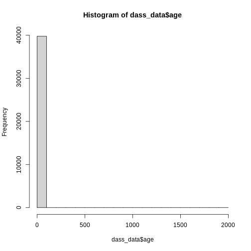
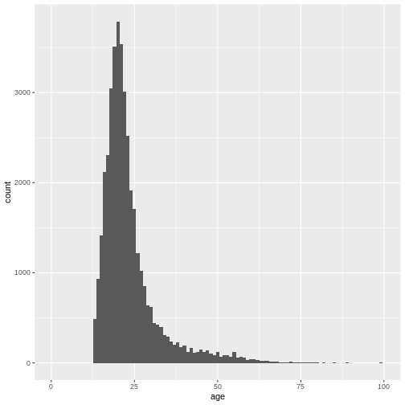
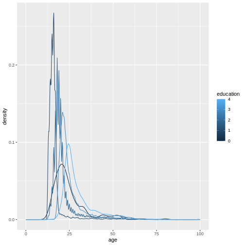
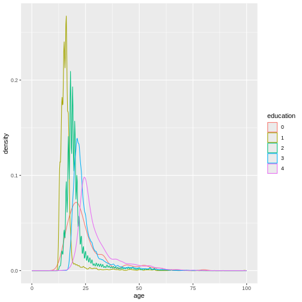
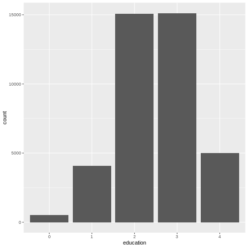

:::::::::::::::::::::::::::::::::::::: questions 

- How can you visualize categorical data?
- How to visualize the relationship of categorical and numerical data?
- 

::::::::::::::::::::::::::::::::::::::::::::::::

::::::::::::::::::::::::::::::::::::: objectives

- Get to know the DASS data from Kaggle
- Explain how to plot distribution of numerical data using `geom_histogram()` and `geom_density()`
- Demonstrate how to group distributions by categorical variables

::::::::::::::::::::::::::::::::::::::::::::::::

## A new set of data

In this section, we will work with a new set of data. Download this data [here](data/kaggle_dass/data.csv) and place it in your `data` folder. There is also a codebook available to download [here](data/kaggle_dass/codebook.txt). 

Some description of the dass data

Let's read in the data first. In my case, it is placed inside a subfolder of `data/` called `kaggle_dass/`. You may need to adjust the path on your end.

``` r
dass_data <- read.csv("data/kaggle_dass/data.csv")
```

As you might already see, this data is quite large. In the *Environment* tab we can see that it contains almost 40.000 entries and 172 variables. For now, we will be working with some of the demographic statistics. We will delve into the actual score in a later episode. You can find information on this data in the codebook provided [here](data/kaggle_dass/codebook.txt). 

Read this codebook in order to familiarize yourself with the data. Then inspect it visually by clicking on the frame or running `View(dass_data)`. What do you notice?

First, let's start getting an overview of the demographics of test-takers. What is their gender, age and education? Compute descriptive statistics for age and inspect gender and education using `table()`


``` r
table(dass_data$gender)
```

``` output

    0     1     2     3 
   67  8789 30367   552 
```

``` r
mean(dass_data$age)
```

``` output
[1] 23.61217
```

``` r
sd(dass_data$age)
```

``` output
[1] 21.58172
```

``` r
range(dass_data$age) # This outputs min() and max() at the same time
```

``` output
[1]   13 1998
```

``` r
table(dass_data$education)
```

``` output

    0     1     2     3     4 
  515  4066 15066 15120  5008 
```
The maximum value of age seems a bit implausible, unless Elrond has decided to take the DASS after Galadriel started flirting with Sauron (sorry, Annatar) again.

## Histograms
We can get an overview of age by using our trust `hist()`:

``` r
hist(dass_data$age)
```



However, this graph is heavily skewed by the outliers in age. We can address this issue easily by converting to a `ggplot` histogram. The `xlim()` layer can restrict the values that are displayed in the plot and gives us a warning about how many values were discarded.


``` r
library(ggplot2) # Don't forget to load the package

ggplot(
  data = dass_data,
  mapping = aes(x = age)
)+
  geom_histogram()+
  xlim(0, 100)
```

``` output
`stat_bin()` using `bins = 30`. Pick better value with `binwidth`.
```

``` warning
Warning: Removed 7 rows containing non-finite outside the scale range
(`stat_bin()`).
```

``` warning
Warning: Removed 2 rows containing missing values or values outside the scale range
(`geom_bar()`).
```


Again, the number of bins might be a bit small:

``` r
ggplot(
  data = dass_data,
  mapping = aes(x = age)
)+
  geom_histogram(bins = 100)+
  xlim(0, 100)
```

``` warning
Warning: Removed 7 rows containing non-finite outside the scale range
(`stat_bin()`).
```

``` warning
Warning: Removed 2 rows containing missing values or values outside the scale range
(`geom_bar()`).
```


We can also adjust the size of the bins, not the number of bins by using the `binwidth` argument.


``` r
ggplot(
  data = dass_data,
  mapping = aes(x = age)
)+
  geom_histogram(binwidth = 1)+
  xlim(0, 100)
```

``` warning
Warning: Removed 7 rows containing non-finite outside the scale range
(`stat_bin()`).
```

``` warning
Warning: Removed 2 rows containing missing values or values outside the scale range
(`geom_bar()`).
```


## Density plots
Often, what interests us is not the number of occurrences for a given value, but rather which values are common and which values are uncommon. By dividing the number of occurrences for a given value by the total number of observation, we can obtain a *density-plot*. In `ggplot` you achieve this by using `geom_density()` instead of `geom_histogram()`.


``` r
ggplot(
  data = dass_data,
  mapping = aes(x = age)
)+
  geom_density()+
  xlim(0, 100)
```

``` warning
Warning: Removed 7 rows containing non-finite outside the scale range
(`stat_density()`).
```


This describes the overall age distribution, but we can also look at the age distribution by education status. What would you expect? 

Again, we do this by using the `color` argument in `aes()`, as I want different colored density plots for each education level.

``` r
ggplot(
  data = dass_data,
  mapping = aes(x = age, color = education)
)+
  geom_density()+
  xlim(0, 100)
```

``` warning
Warning: Removed 7 rows containing non-finite outside the scale range
(`stat_density()`).
```

``` warning
Warning: The following aesthetics were dropped during statistical transformation:
colour.
ℹ This can happen when ggplot fails to infer the correct grouping structure in
  the data.
ℹ Did you forget to specify a `group` aesthetic or to convert a numerical
  variable into a factor?
```


It seems like this didn't work. And the warning message tells us why. We forgot to specify a `group` variable that tells the plotting function that we not only want different colors, we also want different lines, grouped by education status:


``` r
ggplot(
  data = dass_data,
  mapping = aes(x = age, color = education, group = education)
)+
  geom_density()+
  xlim(0, 100)
```

``` warning
Warning: Removed 7 rows containing non-finite outside the scale range
(`stat_density()`).
```



Because education is a numerical variable, `ggplot` uses a sliding color scale to color its values. I think it looks a little more beautiful if we declare that despite having numbers as entries, `education` is not strictly numerical. The different numbers represent distinct levels of educational attainment. We can encode this using `factor()` to convert `education` into a variable-type called *factor* that has this property. 


``` r
dass_data$education <- factor(dass_data$education)
ggplot(
  data = dass_data,
  mapping = aes(x = age, color = education, group = education)
)+
  geom_density()+
  xlim(0, 100)
```

``` warning
Warning: Removed 7 rows containing non-finite outside the scale range
(`stat_density()`).
```



We can make this graph look a little bit better by filling in the area under the curves with the color aswell and making them slightly transparent. This can be done using the `fill` argument and the `alpha` argument. Let's also give the graph a proper title and labels.


``` r
ggplot(
  data = dass_data,
  mapping = aes(x = age, color = education, group = education, fill = education)
)+
  geom_density(alpha = 0.5)+
  xlim(0, 100)+
  labs(
    title = "Age distribution by education status",
    x = "Age",
    y = "Density"
  ) +
  theme_minimal()
```

``` warning
Warning: Removed 7 rows containing non-finite outside the scale range
(`stat_density()`).
```


In this graph, we can see exactly what we would expect. As the highest achieved education increases, the age of test-takers generally gets larger as-well. There just are very little people under 20 with a PhD.

## Bar Charts
As a last step of exploration, let's visualize the number of people that achieved a certain educational status. A bar chart is perfect for this:


``` r
ggplot(
  data = dass_data,
  mapping = aes(x = education)
)+
  geom_bar()
```



This visualizes the same numbers as `table(dass_data$education)` and sometimes, you may not need to create a plot if the numbers already tell *you* everything you need to know. However, remember that often you need to communicate your results to other people. And as they say "A picture says more than 1000 words".

We can also include gender as a variable here, in order to compare educational attainment between available genders. Let's plot gender on the x-axis and color the different education levels.


``` r
ggplot(
  data = dass_data,
  mapping = aes(x = gender, fill = education)
)+
  geom_bar()
```


This graph is very good at showing one thing: there are more females in the data than males. However, this is not the comparison we are interested in. We can plot relative frequencies of education by gender by using the argument `position = "fill"`.


``` r
ggplot(
  data = dass_data,
  mapping = aes(x = gender, fill = education)
)+
  geom_bar(position = "fill")
```


This plot shows that education levels don't differ dramatically between males and females in our sample, with females holding a university degree more often than males.

## Recap - Knowing your data!
It's important to understand your data, its sources and quirks *before* you start working with it! This is why the last few episodes focused so much on descriptive statistics and plots. Get to know the structure of your data, figure out where it came from and what type of people constitute the sample. Monitor your key variables for implausible or impossible values. Statistical outliers we can define later, but make sure to identify issues with impossible values early on! 

## Challenges

::: challenge

## Challenge 1
Review what we learned about the DASS data so far. Is there anything else important to note?

:::

::: challenge

## Challenge 2
Read the [codebook](data/kaggle_dass/codeboot.txt). What is the difference between `Q1A`, `Q1E` and `Q1I`?

:::

::: challenge

## Challenge 3
Descriptives of the elapse times, what might be outliers?

:::

::: challenge

## Challenge 4
Plot urban and familysize / married

:::

::: challenge

## Challenge 5
Plot elapse time and engnat why might differences be?

:::


::::::::::::::::::::::::::::::::::::: keypoints 

-

::::::::::::::::::::::::::::::::::::::::::::::::

