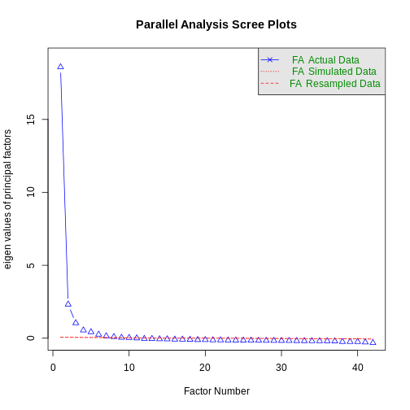

:::::::::::::::::::::::::::::::::::::: questions 

- What is a factor analysis?
- What is the difference between exploratory and confirmatory factor analysis?
- How can I run exploratory factor analysis in R?
- How can I interpret the results of an EFA in R?

::::::::::::::::::::::::::::::::::::::::::::::::

::::::::::::::::::::::::::::::::::::: objectives

- Explain the idea behind factor analysis
- Understand the difference between exploratory and confirmatory factor analysis
- Learn how to conduct exploratory factor analysis in R
- Learn how to interpret the results of EFA in R

::::::::::::::::::::::::::::::::::::::::::::::::

## Factor analysis

Factor analysis is used to identify latent constructs—called factors—that explain the correlation patterns among observed variables. It helps reduce a large number of variables into fewer interpretable components.

It was first developed by Spearman in a field of study near to the heart of the author of this resource. Spearman noticed that students performing well in one subject in school tended to perform well in other subjects - there were high intercorrelations between academic performance. In order to investigate the structure behind these correlations, he used an early version of factor analysis to discover the now well known "g" factor of intelligence. One driving factor at the heart of intercorrelations of cognitive abilities.

This already illustrates several key principles of factor analysis. First, the key object of study are *factors*, mathematical constructs that can explain correlations between measured variables. In some fields such as structural equation modeling, these factors are sometimes referred to as *latent variables*. Latent, because they cannot be measured directly, contrary to *manifest variables* like academic performance. Importantly, these factors can show high validity in measuring a *construct* but are not the same! Construct validation requires a thorough research program before it can conclusively be stated that a certain factors is equal to a construct. For now, keep in mind that factors are mathematical in nature and can be a step towards measuring a construct, but do not necessarily do so.

Secondly, the key data in factor analysis are correlations! The underlying entry in any factor analysis is the covariance (or correlation) matrix. Modern statistical programs also allow us to provide the raw data and handle computing the correlation matrix, but these correlations are the core concept on which factor analysis is built.

Thirdly, there exists a difference between exploratory factor analysis (EFA) and confirmatory factor analysis (CFA).*Exploratory Factor Analysis (EFA)* is used when we do not have a predefined structure. It explores patterns and relationships. This is method is purely descriptive. 
In contrast *Confirmatory Factor Analysis (CFA)* is used when we do have a theory or structure to test. It evaluates how well the model fits the data. This is confirmatory and inferential, meaning we can test whether a given model fits our data, or doesn't. 
Depending on whether you seek to explore the structure behind correlations of variables/items or test a hypothesized structure, choose the correct approach. 
Importantly, you cannot do both. You cannot use the same data to conduct an EFA, and then use this discovery in a subsequent CFA "testing" your factor structure. This needs to be done in an *independent* sample.

This is just a short introduction, details and further tutorial can be found here:
https://lavaan.ugent.be/tutorial/cfa.html -- CFA tutorial lavaan
https://rpubs.com/pjmurphy/758265 -- EFA tutorial Rpubs

Or in textbooks:
- Stemmler et al (2016), Abschn. 2.1.4
- Tabachnik, B. G., & Fidell, L. S. (2001). Using multivariate
statistics. 4th Ed. (chapter 13). Boston: Allyn and Bacon.

## Examples using DASS data
Now, lets apply this theory to some actual data. Recall the DASS data from earlier lessons.
Here, we have item-wise responses to a questionnaire claiming to measure three constructs, *depression, anxiety, and stress*


``` r
library(dplyr)
```

``` output

Attaching package: 'dplyr'
```

``` output
The following objects are masked from 'package:stats':

    filter, lag
```

``` output
The following objects are masked from 'package:base':

    intersect, setdiff, setequal, union
```

``` r
dass_data <- read.csv("data/kaggle_dass/data.csv")
```

Let's make our lives a little bit easier by only selecting the relevant columns for the subsequent factor analysis.


``` r
fa_data <- dass_data %>% 
  filter(testelapse < 600) %>% 
  select(starts_with("Q")& ends_with("A"))

psych::describe(fa_data)
```

``` output
     vars     n mean   sd median trimmed  mad min max range  skew kurtosis   se
Q1A     1 37242 2.62 1.03      3    2.65 1.48   1   4     3 -0.03    -1.19 0.01
Q2A     2 37242 2.17 1.11      2    2.09 1.48   1   4     3  0.46    -1.16 0.01
Q3A     3 37242 2.23 1.04      2    2.16 1.48   1   4     3  0.40    -1.02 0.01
Q4A     4 37242 1.95 1.05      2    1.82 1.48   1   4     3  0.75    -0.71 0.01
Q5A     5 37242 2.53 1.07      2    2.54 1.48   1   4     3  0.04    -1.26 0.01
Q6A     6 37242 2.55 1.05      2    2.56 1.48   1   4     3  0.04    -1.21 0.01
Q7A     7 37242 1.93 1.04      2    1.79 1.48   1   4     3  0.79    -0.62 0.01
Q8A     8 37242 2.49 1.05      2    2.48 1.48   1   4     3  0.10    -1.20 0.01
Q9A     9 37242 2.67 1.07      3    2.71 1.48   1   4     3 -0.13    -1.26 0.01
Q10A   10 37242 2.46 1.14      2    2.45 1.48   1   4     3  0.10    -1.40 0.01
Q11A   11 37242 2.81 1.05      3    2.88 1.48   1   4     3 -0.28    -1.19 0.01
Q12A   12 37242 2.43 1.07      2    2.41 1.48   1   4     3  0.13    -1.22 0.01
Q13A   13 37242 2.79 1.07      3    2.86 1.48   1   4     3 -0.26    -1.26 0.01
Q14A   14 37242 2.58 1.08      2    2.61 1.48   1   4     3 -0.01    -1.29 0.01
Q15A   15 37242 1.83 0.99      2    1.67 1.48   1   4     3  0.94    -0.28 0.01
Q16A   16 37242 2.53 1.11      2    2.53 1.48   1   4     3  0.03    -1.35 0.01
Q17A   17 37242 2.66 1.16      3    2.71 1.48   1   4     3 -0.16    -1.44 0.01
Q18A   18 37242 2.47 1.07      2    2.46 1.48   1   4     3  0.10    -1.23 0.01
Q19A   19 37242 1.95 1.07      2    1.81 1.48   1   4     3  0.78    -0.74 0.01
Q20A   20 37242 2.33 1.12      2    2.29 1.48   1   4     3  0.25    -1.30 0.01
Q21A   21 37242 2.36 1.17      2    2.32 1.48   1   4     3  0.22    -1.43 0.01
Q22A   22 37242 2.35 1.03      2    2.31 1.48   1   4     3  0.25    -1.08 0.01
Q23A   23 37242 1.57 0.87      1    1.39 0.00   1   4     3  1.47     1.24 0.00
Q24A   24 37242 2.45 1.05      2    2.43 1.48   1   4     3  0.15    -1.18 0.01
Q25A   25 37242 2.19 1.08      2    2.11 1.48   1   4     3  0.42    -1.12 0.01
Q26A   26 37242 2.66 1.07      3    2.70 1.48   1   4     3 -0.12    -1.26 0.01
Q27A   27 37242 2.61 1.05      3    2.64 1.48   1   4     3 -0.04    -1.23 0.01
Q28A   28 37242 2.22 1.08      2    2.15 1.48   1   4     3  0.39    -1.13 0.01
Q29A   29 37242 2.65 1.06      3    2.69 1.48   1   4     3 -0.10    -1.24 0.01
Q30A   30 37242 2.40 1.08      2    2.37 1.48   1   4     3  0.17    -1.24 0.01
Q31A   31 37242 2.38 1.05      2    2.35 1.48   1   4     3  0.22    -1.13 0.01
Q32A   32 37242 2.45 1.02      2    2.44 1.48   1   4     3  0.15    -1.10 0.01
Q33A   33 37242 2.42 1.05      2    2.40 1.48   1   4     3  0.15    -1.18 0.01
Q34A   34 37242 2.64 1.15      3    2.67 1.48   1   4     3 -0.12    -1.44 0.01
Q35A   35 37242 2.31 1.00      2    2.26 1.48   1   4     3  0.31    -0.96 0.01
Q36A   36 37242 2.27 1.11      2    2.21 1.48   1   4     3  0.34    -1.24 0.01
Q37A   37 37242 2.38 1.14      2    2.35 1.48   1   4     3  0.21    -1.37 0.01
Q38A   38 37242 2.40 1.19      2    2.38 1.48   1   4     3  0.16    -1.49 0.01
Q39A   39 37242 2.45 1.02      2    2.44 1.48   1   4     3  0.15    -1.10 0.01
Q40A   40 37242 2.65 1.11      3    2.69 1.48   1   4     3 -0.13    -1.34 0.01
Q41A   41 37242 1.97 1.05      2    1.84 1.48   1   4     3  0.74    -0.72 0.01
Q42A   42 37242 2.69 1.03      3    2.74 1.48   1   4     3 -0.11    -1.20 0.01
```


::: callout
## Beware of reversed items

This is especially relevant for EFA, but also for cfa as this might have some adverse impact

:::

In theory, this questionnaire has a well-known proposed factor structure. It's in the name - three factors: depression, anxiety, stress. Since it is also known which items are supposed to measure which factor, this would make the DASS data ideally suited for *CFA*, not EFA. However, for the sake of this exercise, let's forget all of this for a second and pretend like we have no idea how the factor structure might look like.

As a first step, make sure the data is properly cleaned. After this is done, we can start the proper factor analysis process by investigating the correlation matrix of our data. Ideally, we will see high correlations between some items / variables. Should we observe no, or low correlations between all items, factor analysis will have a hard time identifying any underlying factors, as the items do not seem to share common influences.

Let's start by computing the correlation matrix using `cor()`.


``` r
corr_mat <- cor(fa_data, use = "pairwise.complete.obs")

# head(corr_mat)
```

Now, we can visualize this using the package `ggcorrplot`.


``` r
ggcorrplot::ggcorrplot(corr_mat)
```


In our case, we are greeted by a red square. A welcome sign for factor analysis as it indicates high correlations between items. This is even unusually uniform, other examples may show some variables correlating high with each other and low with other items. This is also perfectly normal. It's only important that there are *some* correlations before proceeding with factor analysis.

## Running the EFA
Now, we can already start running the EFA. In R, the easiest way to do this is using `fa.parallel()` from the package `psych`.


``` r
library(psych)

efa_result <- fa.parallel(fa_data, fa = "fa")
```



``` output
Parallel analysis suggests that the number of factors =  9  and the number of components =  NA 
```

Now, this function already gives you a lot of insight. First of all, you get two immediate results - a plot and a message informing you about the number of factors.

As a general rule, I would focus mainly on the plot and discard the message. This message is based on a resampling technique used to simulate new data without an underlying factor structure and then determines how many factors in the true data deviate significantly from this random simulation. In large datasets, this may overestimate the number of factors severly, as is the case in this example.

More important is the plot overall. It is called a *Scree-plot* and shows the eigenvalues of the factor solution. These eigenvalues indicate how much variance is explained by a factor. The larger the eigenvalue, the more variance explained by a factor.

These eigenvalues are already the basis of a selection technique on how many factors should be retained. Kaisers criterion states that all factors with eigenvalues > 1 should be extracted. In our case, these are the eigenvalues:


``` r
efa_result$fa.values
```

``` output
 [1] 18.588506243  2.318687720  1.042780083  0.543667379  0.425206073
 [6]  0.257496536  0.145156657  0.094570513  0.041015178  0.028355531
[11]  0.001674441 -0.037595873 -0.041986500 -0.060701707 -0.065750863
[16] -0.082565635 -0.084817673 -0.095206394 -0.113248993 -0.115666333
[21] -0.129713392 -0.134490302 -0.144248475 -0.147258433 -0.150618100
[26] -0.153739659 -0.159396508 -0.166141135 -0.170279676 -0.172584141
[31] -0.175380247 -0.184334478 -0.188107697 -0.190790974 -0.194604989
[36] -0.195616247 -0.206315648 -0.243863018 -0.245374734 -0.248541704
[41] -0.280156397 -0.319514269
```


In this case, 3 factors exceed eigenvalues of 1 and should thus be extracted (which aligns with theory nicely).

Another way of extracting the number of factors is by investigating the shape of the Scree plot directly. Here, we can see that the first factor has by far the largest value and thus already explains substantial variance. We can also see that all the other factors explain roughly the same amount of variance, with a possible exception of number 2 and 3. But certainly after the third factor, the amount of variance is low and decreases linearly.

In this method, we are looking to identify the "elbow" in the eigenvalue progression after which there is a sudden drop off in the variance explained. In this case, there is a strong argument that this occurs right after the first factor. The Scree plot would thus hint at only extracting one factor.

However, be cautious of relying on a single criterion to evaluate the number of factors. Kaisers criterion may be too liberal and the Scree plot may not be informative enough to warrant a certain guess. In the end, you should also select the number of factors that make the most sense psycho*logically* and allow you to interpret the findings. You can not only rely on the eigenvalues to make this choice, but should also investigate the factor loadings of the items for a given number of factors.

## Investigating Factor Loadings
Factor loadings can be determined for any given number of factors. They tell you how strongly the factor overall is related to a specific item. The higher, the better. The item with the highest loading on a factor is called the "marker item" and may inform you (in conjunction with the other items loading highly) as to what construct this factor actually reflects.

In principle, you are looking for *simple structure*. Items should load highly on one and only one factor while showing low loadings (< 0.3) on the other factors. If this is not the case, attributing an item to a single factor might not be warranted.

In order to obtain the factor loadings, we need to make two important choices. The first concerns the number of factors we want to investigate. For this example, let's look at both one and three factors and investigate their structure.
The second decision concerns the correlation between factors themselves. If you have strong reason to believe that the factors should be uncorrelated, or want to restrict the factors to be uncorrelated, i.e. independent of each other, you need to apply an *orthoghonal* rotation in the factor analyis. If you believe that the factors may themselves be related, you should apply an *oblique* rotation, which still allows for correlations between factors.
In the case of only one extracted factor, this does not make a difference. In our specific example with three extracted factors, depression, anxiety, and stress may indeed be related. So we will proceed with the oblique rotation method called *oblimin*.

Let's investigate the factor loadings for a three factor oblique solution.


``` r
fa_solution_3 <- psych::fa(fa_data, nfactors = 3, rotate = "oblimin")
```

``` output
Loading required namespace: GPArotation
```

``` r
print(fa_solution_3)
```

``` output
Factor Analysis using method =  minres
Call: psych::fa(r = fa_data, nfactors = 3, rotate = "oblimin")
Standardized loadings (pattern matrix) based upon correlation matrix
       MR1   MR3   MR2   h2   u2 com
Q1A   0.08  0.73 -0.03 0.60 0.40 1.0
Q2A   0.05  0.07  0.42 0.26 0.74 1.1
Q3A   0.73  0.05  0.02 0.61 0.39 1.0
Q4A   0.03 -0.04  0.74 0.53 0.47 1.0
Q5A   0.62  0.13  0.04 0.56 0.44 1.1
Q6A  -0.05  0.71  0.05 0.51 0.49 1.0
Q7A   0.01 -0.07  0.81 0.58 0.42 1.0
Q8A   0.16  0.37  0.27 0.50 0.50 2.3
Q9A  -0.01  0.38  0.38 0.48 0.52 2.0
Q10A  0.89 -0.07 -0.02 0.69 0.31 1.0
Q11A  0.10  0.76 -0.07 0.62 0.38 1.1
Q12A -0.01  0.33  0.48 0.54 0.46 1.8
Q13A  0.65  0.19  0.02 0.66 0.34 1.2
Q14A -0.09  0.60  0.08 0.35 0.65 1.1
Q15A  0.14 -0.03  0.59 0.43 0.57 1.1
Q16A  0.77  0.03 -0.01 0.62 0.38 1.0
Q17A  0.74  0.07  0.01 0.64 0.36 1.0
Q18A  0.04  0.55  0.03 0.37 0.63 1.0
Q19A -0.01  0.03  0.58 0.35 0.65 1.0
Q20A  0.11  0.25  0.45 0.52 0.48 1.7
Q21A  0.88 -0.07  0.02 0.72 0.28 1.0
Q22A  0.17  0.41  0.20 0.49 0.51 1.8
Q23A  0.10 -0.05  0.58 0.37 0.63 1.1
Q24A  0.70  0.07  0.01 0.58 0.42 1.0
Q25A  0.00  0.02  0.66 0.46 0.54 1.0
Q26A  0.62  0.19  0.02 0.60 0.40 1.2
Q27A  0.11  0.70 -0.05 0.57 0.43 1.1
Q28A  0.00  0.24  0.58 0.58 0.42 1.3
Q29A  0.06  0.62  0.12 0.56 0.44 1.1
Q30A  0.13  0.34  0.27 0.43 0.57 2.2
Q31A  0.72  0.03  0.02 0.56 0.44 1.0
Q32A  0.04  0.60  0.06 0.45 0.55 1.0
Q33A  0.03  0.30  0.48 0.55 0.45 1.7
Q34A  0.76  0.07  0.00 0.66 0.34 1.0
Q35A  0.08  0.56  0.06 0.44 0.56 1.1
Q36A  0.18  0.24  0.40 0.53 0.47 2.1
Q37A  0.86 -0.08  0.00 0.64 0.36 1.0
Q38A  0.90 -0.09  0.01 0.70 0.30 1.0
Q39A  0.10  0.57  0.10 0.52 0.48 1.1
Q40A  0.02  0.37  0.36 0.47 0.53 2.0
Q41A  0.00 -0.07  0.77 0.53 0.47 1.0
Q42A  0.51  0.16  0.03 0.43 0.57 1.2

                       MR1  MR3  MR2
SS loadings           9.01 6.93 6.32
Proportion Var        0.21 0.17 0.15
Cumulative Var        0.21 0.38 0.53
Proportion Explained  0.40 0.31 0.28
Cumulative Proportion 0.40 0.72 1.00

 With factor correlations of 
     MR1  MR3  MR2
MR1 1.00 0.70 0.59
MR3 0.70 1.00 0.69
MR2 0.59 0.69 1.00

Mean item complexity =  1.3
Test of the hypothesis that 3 factors are sufficient.

df null model =  861  with the objective function =  27.87 with Chi Square =  1037323
df of  the model are 738  and the objective function was  2.08 

The root mean square of the residuals (RMSR) is  0.03 
The df corrected root mean square of the residuals is  0.03 

The harmonic n.obs is  37242 with the empirical chi square  41215.05  with prob <  0 
The total n.obs was  37242  with Likelihood Chi Square =  77517.62  with prob <  0 

Tucker Lewis Index of factoring reliability =  0.914
RMSEA index =  0.053  and the 90 % confidence intervals are  0.053 0.053
BIC =  69750.03
Fit based upon off diagonal values = 1
Measures of factor score adequacy             
                                                   MR1  MR3  MR2
Correlation of (regression) scores with factors   0.98 0.96 0.96
Multiple R square of scores with factors          0.96 0.93 0.92
Minimum correlation of possible factor scores     0.92 0.85 0.83
```

Let's take a closer look at the factor loadings:

``` r
print(fa_solution_3$loadings, cutoff = 0.3)
```

``` output

Loadings:
     MR1    MR3    MR2   
Q1A          0.730       
Q2A                 0.423
Q3A   0.729              
Q4A                 0.741
Q5A   0.622              
Q6A          0.714       
Q7A                 0.809
Q8A          0.366       
Q9A          0.380  0.379
Q10A  0.886              
Q11A         0.758       
Q12A         0.325  0.477
Q13A  0.652              
Q14A         0.598       
Q15A                0.585
Q16A  0.771              
Q17A  0.745              
Q18A         0.553       
Q19A                0.576
Q20A                0.446
Q21A  0.884              
Q22A         0.412       
Q23A                0.583
Q24A  0.705              
Q25A                0.663
Q26A  0.616              
Q27A         0.704       
Q28A                0.580
Q29A         0.615       
Q30A         0.344       
Q31A  0.716              
Q32A         0.604       
Q33A         0.301  0.483
Q34A  0.760              
Q35A         0.562       
Q36A                0.405
Q37A  0.857              
Q38A  0.895              
Q39A         0.567       
Q40A         0.368  0.364
Q41A                0.774
Q42A  0.509              

                 MR1   MR3   MR2
SS loadings    8.037 5.409 5.109
Proportion Var 0.191 0.129 0.122
Cumulative Var 0.191 0.320 0.442
```

Here, we can see that some items load highly one one of the three factors and do not load on any other factor (like 1-7). However, some items load on two factors (item 9, 12 etc). Here, we may want to investigate the items themselves to figure out which items load highly on which factor and why some of these items cannot be attributed to a single factor.

The marker items for the factors seem to be item 38 for factor 1, item 11 for factor 2, and item 7 for factor three.
In the codebook, we can look up the item text itself.

- Item 38: "I felt that life was meaningless."
- Item 11: "I found myself getting upset rather easily."
- Item 7: "I had a feeling of shakiness (eg, legs going to give way)."

Now, one might see the factors Depression (meaningless life), Anxiety (getting upset) and Stress (shakiness) in these factors. 

We can visualize the factor structure using `fa.diagram()`.


``` r
fa.diagram(fa_solution_3, simple = TRUE, cut = 0.3, digits = 2)
```


Lastly, we always have to investigate the correlations between the factors themselves. The plot already reveals substantial correlations of the three factors between 0.6 and 0.7. 


``` r
fa_solution_3$score.cor
```

``` output
          [,1]      [,2]      [,3]
[1,] 1.0000000 0.7470426 0.6650608
[2,] 0.7470426 1.0000000 0.7935208
[3,] 0.6650608 0.7935208 1.0000000
```
This indicates that there might be a higher order factor influencing all three factors. In the next episode, we can define a model testing whether this is the case or not.

::: challenge 

## Challenge 1

Read in data and answer the question: do we have a hypothesis as to how the structure should be?

:::

::: challenge 

## Challenge 2

Run an EFA, how many factors would you extract using the Kaiser criterion, how many using the scree-plot

:::

::: challenge 

## Challenge 3

Choose three factors and investigate the item loadings. Do we have simple structure?

:::

::: challenge 

## Challenge 4

Choose one factor and investigate the item loadings

:::

::::::::::::::::::::::::::::::::::::: keypoints 

- Something

::::::::::::::::::::::::::::::::::::::::::::::::

